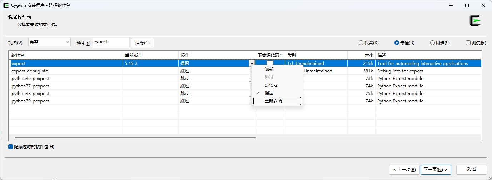
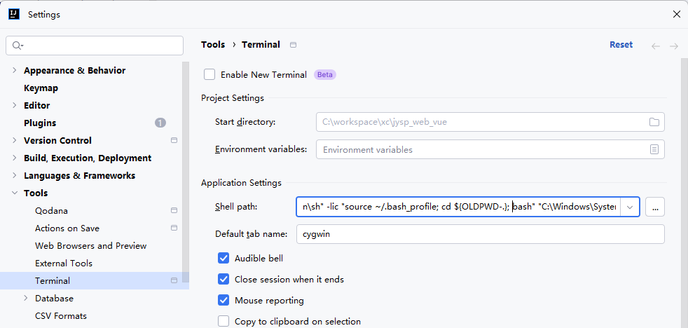
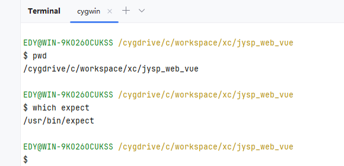

# Cygwin简单使用

使用目的：为了在windows中使用expect指令的一种方式之一

## cygwin下载
https://www.cygwin.com/install.html


## 安装expect


## idea配置终端

设置位置 `File->Setting->Tools->Terminal->Shell path`


设置位置 File->Setting->Tools->Terminal->Shell path

Cygwin
```shell
"C:\cygwin64\bin\sh" -lic "source ~/.bash_profile; cd ${OLDPWD-.}; bash"
```

Linux子系统

```shell
"C:\Windows\System32\wsl.exe"
```


完整配置

```shell
"C:\cygwin64\bin\sh" -lic "source ~/.bash_profile; cd ${OLDPWD-.}; bash" "C:\Windows\System32\wsl.exe"
```



效果




