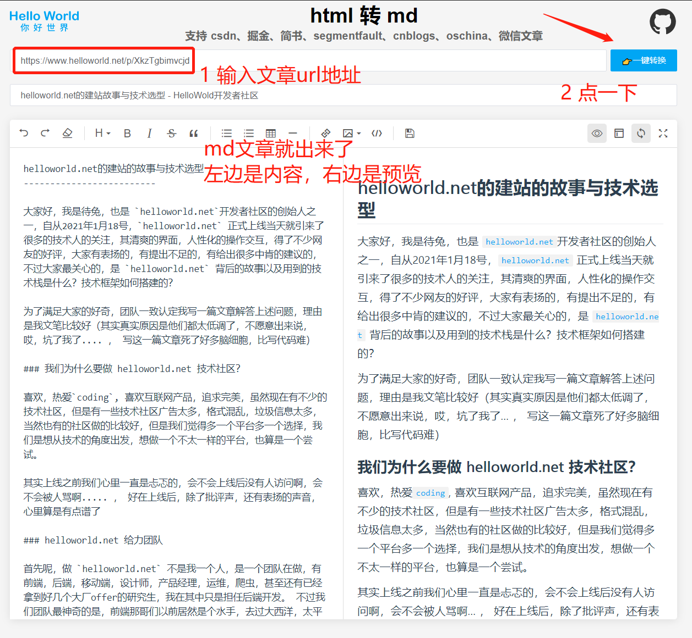

# 🎉 Html2md 🥳


在线网址：https://www.helloworld.net/html2md

github仓库地址：https://github.com/helloworld-Co/html2md


`html2md` 是由 [helloworld开发者社区](https://www.helloworld.net/) 开源的一款轻量级功能强大的html转md工具💪🏻，纯前端开发，不需要后端接口（ Node是我们前端的😗！），支持多平台，一键将文章链接转换为md，方便大家收藏和保存文章🤪。请勿做其它用途

[html2md地址](https://www.helloworld.net/html2md) 👈🏻

## 教程，如下图

[](https://github.com/helloworld-Co/html2md/blob/main/demo.png)


## 技术栈

- [vue](https://cn.vuejs.org/) 前端三剑客之一，主张最少，具有高度灵活性的渐进式框架
- [nuxt](https://zh.nuxtjs.org/) 通过利用 Vue.js 和 Node.js最佳实践来构建高性能应用程序
- [express](https://www.expressjs.com.cn/) 基于 Node.js 平台，快速、开放、极简的 Web 开发框架
- [element-ui](https://element.eleme.cn/#/zh-CN) 宇宙第一 Vue 第三方组件库，有不服？
- [js-dom](https://github.com/jsdom/jsdom) 一款可在 Node 环境下模拟浏览器的 API 的库
- [turndown](https://github.com/domchristie/turndown) 使用 JavaScript 将 HTML 转换为 Markdown
- [axios](http://www.axios-js.com/) 易用、简洁且高效的 http库，支持浏览器和 Node 环境。
- [mavon-editor](https://github.com/hinesboy/mavonEditor) 一款基于 Vue 的 markdown 编辑器，支持所见即所得
- [sass](https://www.sass.hk/) 强大的 Css 预处理器之一

## 使用

> 注意：node 版本要求： v14.18.0

### 第一步：下载

```
git clone git@github.com:helloworld-Co/html2md.git
cd ./html2md
```

### 第二步：安装

```
npm install
或者
yarn install
```

### 第三步：启动

```
npm run dev
或者
yarn dev
```

## 使用备注

- **防盗链**：由于各大网站的图片基本都会有防盗链机制，转换出来的 md 里的图片会无法正常预览，这个不慌 😳，把 md 内容复制到 [helloworld开发者社区](https://www.helloworld.net/) 的写作文本框中就能正常显示了👌🏻。
- **微信文章**：微信文章内容格式差异性比较大，不能保证 💯% 好使，如果一篇不能解决，那就换下一篇吧😏。