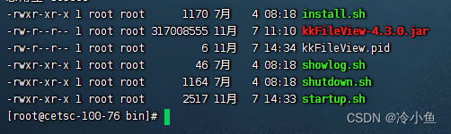
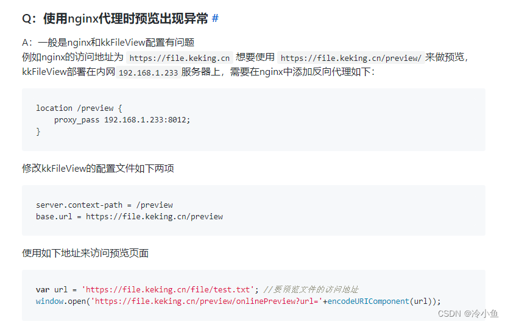
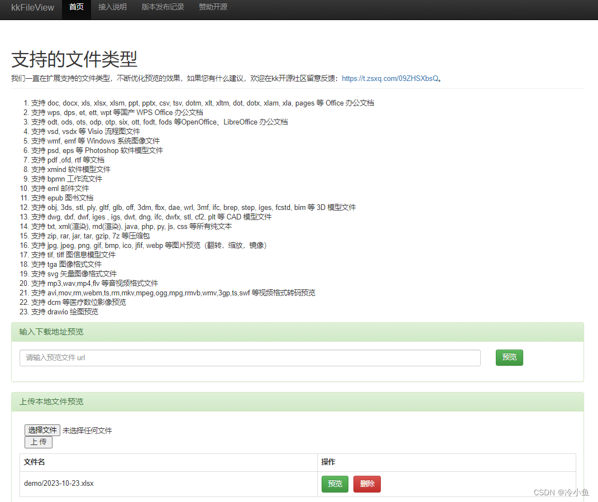

# CentOS7.9部署kkfileview经验帖

安装介质版本
-----------------------------------

文件预览：[KKFile V4.3.0](https://gitee.com/kekingcn/file-online-preview) [官网](http://kkfileview.keking.cn/zh-cn/docs/home.html)

OFFICE插件：[libreoffice7.6](https://www.libreoffice.org/donate/dl/rpm-x86_64/7.6.2/zh-CN/LibreOffice_7.6.2_Linux_x86-64_rpm.tar.gz)

操作系统：CentOS Linux release 7.9.2009 (Core)

字体包：[字体](http://kkfileview.keking.cn/fonts.zip)

安装Office插件
---------------------------------------

下载好Office插件后，开始安装：

解压压缩文件：

```sh
tar -zxvf LibreOffice_7.6.2_Linux_x86-64_rpm.tar.gz
```

进入RPM文件目录：

```sh
cd LibreOffice_7.6.2.1_Linux_x86-64_rpm/RPM
```

执行安装指令：

```sh
rpm -ivh *.rpm
或者
yum localinstall *.rpm
```

安装字体
---------------------------------

大部分Linux系统上并没有预装中文字体或字体不全，需要把常用字体拷贝到Linux服务器上，具体操作如下：  
下载如下字体包 http://kkfileview.keking.cn/fonts.zip 文件解压完整拷贝到Linux下的 /usr/share/fonts目录。  
然后依次执行mkfontscale 、mkfontdir 、fc-cache使字体生效。

```sh
cd /usr/share/fonts
mkfontscale
mkfontdir
fc-cache
```

安装KKFILEVIEW
-----------------------------------------

### 方式一

俩种方式，一是氪金，99米加入星球获取。  
  

### 方式二

另外一种是，下载源代码，本地编译。  
https://gitee.com/kekingcn/file-online-preview

```sh
1. 从码云仓库拉取代码 #
git clone https://gitee.com/kekingcn/file-online-preview.git
2. 使用maven编译打包 #
cd file-online-preview
mvn clean package -DskipTests
3. 使用docker构建镜像 #
docker build -t keking/kkfileview:v4.0.0 .
```

不管是哪种方式，将得到的gz压缩包上传到服务器安装目录。  
切换到工作目录：  
  
install.sh 安装内置的office插件，听说有问题，笔者是用的独立下载的，office插件目录是：/opt/libreoffice7.6。

showlog.sh 查看日志  
shutdown.sh 停止服务  
startup.sh 启动服务  
由于后期测试发现性能比较慢，且没有做GC的处理。因此笔者做了优化，供参考：  
\-Xms6144m -Xmx6144m 建议设置为服务器内存的四分之一为最佳。

```sh
 nohup java -Xms6144m -Xmx6144m -Xmn512m -Xloggc:../log/kkfile_gc.log -verbose:gc -XX:+PrintGCDetails -XX:+PrintGCDateStamps -XX:+PrintGCTimeStamps -XX:+UseGCLogFileRotation -XX:NumberOfGCLogFiles=10 -XX:GCLogFileSize=100M  -Dfile.encoding=UTF-8 -Dspring.config.location=../config/application.properties -jar kkFileView-4.3.0.jar > ../log/kkFileView.log 2>&1 &
```

接下来修改下kkfile的配置文件：

```sh
vim kkFileView-4.3.0/config/application.properties
```

以下配置供参考：

```properties
#######################################不可动态配置，需要重启生效#######################################
server.port = ${KK_SERVER_PORT:8012}
#配合Nginx的配置修改
server.servlet.context-path=/preview
server.servlet.encoding.charset = utf-8
#文件上传限制前端
spring.servlet.multipart.max-file-size=500MB
#文件上传限制
spring.servlet.multipart.max-request-size=500MB
## Freemarker 配置
spring.freemarker.template-loader-path = classpath:/web/
spring.freemarker.cache = false
spring.freemarker.charset = UTF-8
spring.freemarker.check-template-location = true
spring.freemarker.content-type = text/html
spring.freemarker.expose-request-attributes = true
spring.freemarker.expose-session-attributes = true
spring.freemarker.request-context-attribute = request
spring.freemarker.suffix = .ftl

# office-plugin
## office转换服务的进程数，默认开启两个进程
office.plugin.server.ports = 2101,2102
## office 转换服务 task 超时时间，默认五分钟
office.plugin.task.timeout = 5m

#预览生成资源路径（默认为打包根路径下的file目录下）
#file.dir = D:\\kkFileview\\
file.dir = ${KK_FILE_DIR:default}

#允许预览的本地文件夹 默认不允许任何本地文件被预览
#WINDOWS参考 local.preview.dir =  \D:\\kkFileview\\1\\1.txt (注意前面必须添加反斜杠)
#LINUX参考   local.preview.dir =  /opt/1.txt (注意前面必须是正斜杠)
#使用方法 windows  file://d:/1/1.txt  linux file:/opt/1/1.txt
#file 协议参考：https://datatracker.ietf.org/doc/html/rfc8089
#把本地日志文件做个挂载
local.preview.dir =/opt/logs/ 

#openoffice home路径,根据实际的路径来修改
#office.home = C:\\Program Files (x86)\\OpenOffice 4
office.home =/opt/libreoffice7.6

#缓存实现类型，不配默认为内嵌RocksDB(type = default)实现，可配置为redis(type = redis)实现（需要配置spring.redisson.address等参数）和 JDK 内置对象实现（type = jdk）,
cache.type =  ${KK_CACHE_TYPE:jdk}
#redis连接，只有当cache.type = redis时才有用
spring.redisson.address = ${KK_SPRING_REDISSON_ADDRESS:127.0.0.1:6379}
spring.redisson.password = ${KK_SPRING_REDISSON_PASSWORD:}
#缓存是否自动清理 true 为开启，注释掉或其他值都为关闭
cache.clean.enabled = ${KK_CACHE_CLEAN_ENABLED:true}
#缓存自动清理时间，cache.clean.enabled = true时才有用，cron表达式，基于Quartz cron
cache.clean.cron = ${KK_CACHE_CLEAN_CRON:0 0 3 * * ?}

#######################################可在运行时动态配置#######################################
#提供预览服务的地址，默认从请求url读，如果使用nginx等反向代理，需要手动设置
#base.url = https://file.keking.cn
base.url =http://x.x.x.x:80/preview

#信任站点，多个用','隔开，设置了之后，会限制只能预览来自信任站点列表的文件，默认不限制
#trust.host = kkview.cn
trust.host = ${KK_TRUST_HOST:default}

#是否启用缓存
cache.enabled = ${KK_CACHE_ENABLED:true}

#文本类型，默认如下，可自定义添加
simText = ${KK_SIMTEXT:txt,html,htm,asp,jsp,xml,json,properties,md,gitignore,log,java,py,c,cpp,sql,sh,bat,m,bas,prg,cmd}
#多媒体类型，默认如下，可自定义添加
media = ${KK_MEDIA:mp3,wav,mp4,flv}
#是否开启多媒体类型转视频格式转换,目前可转换视频格式有：avi,mov,wmv,3gp,rm
#请谨慎开启此功能，建议异步调用添加到处理队列，并且增加任务队列处理线程，防止视频转换占用完线程资源，转换比较耗费时间,并且控制了只能串行处理转换任务
media.convert.disable = ${KK_MEDIA_CONVERT_DISABLE:false}
#支持转换的视频类型
convertMedias = ${KK_CONVERTMEDIAS:avi,mov,wmv,mkv,3gp,rm}
#office类型文档(word ppt)样式，默认为图片(image)，可配置为pdf（预览时也有按钮切换）
office.preview.type = ${KK_OFFICE_PREVIEW_TYPE:image}
#是否关闭office预览切换开关，默认为false，可配置为true关闭
office.preview.switch.disabled = ${KK_OFFICE_PREVIEW_SWITCH_DISABLED:false}

#是否禁止演示模式
pdf.presentationMode.disable = ${KK_PDF_PRESENTATION_MODE_DISABLE:true}
#是否禁止打开文件
pdf.openFile.disable = ${KK_PDF_OPEN_FILE_DISABLE:true}
#是否禁止打印转换生成的pdf文件
pdf.print.disable = ${KK_PDF_PRINT_DISABLE:true}
#是否禁止下载转换生成的pdf文件
pdf.download.disable = ${KK_PDF_DOWNLOAD_DISABLE:false}
#是否禁止bookmark
pdf.bookmark.disable = ${KK_PDF_BOOKMARK_DISABLE:true}
#是否禁用首页文件上传
file.upload.disable = ${KK_FILE_UPLOAD_ENABLED:false}

#预览源为FTP时 FTP用户名，可在ftp url后面加参数ftp.username=ftpuser指定，不指定默认用配置的
ftp.username = ${KK_FTP_USERNAME:ftpuser}
#预览源为FTP时 FTP密码，可在ftp url后面加参数ftp.password=123456指定，不指定默认用配置的
ftp.password = ${KK_FTP_PASSWORD:123456}
#预览源为FTP时, FTP连接默认ControlEncoding(根据FTP服务器操作系统选择，Linux一般为UTF-8，Windows一般为GBK)，可在ftp url后面加参数ftp.control.encoding=UTF-8指定，不指定默认用配置的
ftp.control.encoding = ${KK_FTP_CONTROL_ENCODING:UTF-8}

#水印内容
#例：watermark.txt = ${WATERMARK_TXT:凯京科技内部文件，严禁外泄}
#如需取消水印，内容设置为空即可，例：watermark.txt = ${WATERMARK_TXT:}
watermark.txt = ${WATERMARK_TXT:}
#水印x轴间隔
watermark.x.space = ${WATERMARK_X_SPACE:300}
#水印y轴间隔
watermark.y.space = ${WATERMARK_Y_SPACE:300}
#水印字体
watermark.font = ${WATERMARK_FONT:微软雅黑}
#水印字体大小
watermark.fontsize = ${WATERMARK_FONTSIZE:18px}
#水印字体颜色
watermark.color = ${WATERMARK_COLOR:black}
#水印透明度，要求设置在大于等于0.005，小于1
watermark.alpha = ${WATERMARK_ALPHA:0.25}
#水印宽度
watermark.width = ${WATERMARK_WIDTH:180}
#水印高度
watermark.height = ${WATERMARK_HEIGHT:80}
#水印倾斜度数，要求设置在大于等于0，小于90
watermark.angle = ${WATERMARK_ANGLE:30}

#Tif类型图片浏览模式：tif（利用前端js插件浏览）；jpg（转换为jpg后前端显示）；pdf（转换为pdf后显示，便于打印）
tif.preview.type = ${KK_TIF_PREVIEW_TYPE:tif}
# 备案信息，默认为空
beian = ${KK_BEIAN:default}
#禁止上传类型
prohibit = ${KK_PROHIBIT:exe,dll,dat,sh}
#删除密码
delete.password = ${KK_DELETE_PASSWORD:cestc@135246}
#删除 转换后OFFICE、CAD、TIFF、压缩包源文件 默认开启 节约磁盘空间
delete.source.file = ${KK_DELETE_SOURCE_FILE:false}
#配置PDF文件生成图片的像素大小，dpi 越高，图片质量越清晰，同时也会消耗更多的计算资源。
pdf2jpg.dpi = ${KK_PDF2JPG_DPI:144}
#xlsx格式前端解析
office.type.web = ${KK_OFFICE_TYPE_WEB:web}


```

配置文件修改好之后，就可以切换到bin目录下启动了：

```sh
#启动
sh startup.sh
#查看日志
sh showlog.sh
```

最后配置下Nginx的conf文件  
在80端口（根据项目修改）的监听下增加以下路由，8012是KKFileView启动的默认端口

```nginx
location /preview {
     proxy_pass http://x.x.x.x:8012;
}
```

官网帮助相关截图：  


最后效果图，可以根据实际的IP配置访问：  


附录
-------------------------------

示例DEMO

```html
<html>
<script type="text/javascript" src="http://x.x.x.x:80/preview/js/base64.min.js"></script>
<body>
<script>
var previewUrl = 'http://y.y.y.y:81/lawAndRegulation/word/781923063709323264.doc'; //要预览文件的访问地址
window.open('http://x.x.x.x:80/preview/onlinePreview?url='+encodeURIComponent(Base64.encode(previewUrl)));
</script>
</body>
<html>
```
  

本文转自 [http://t.csdnimg.cn/AJhEx](http://t.csdnimg.cn/AJhEx)，如有侵权，请联系删除。