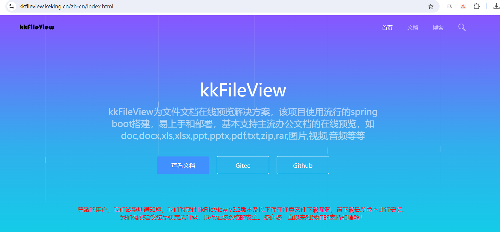

# kkfileview

## 介绍

https://kkfileview.keking.cn/zh-cn/docs/home.html



## 使用docker方式部署

#### 拉取镜像

```bash
# 网络环境方便访问docker中央仓库
docker pull keking/kkfileview:4.1.0

# 网络环境不方便访问docker中央仓库
wget https://kkfileview.keking.cn/kkFileView-4.1.0-docker.tar
docker load -i kkFileView-4.1.0-docker.tar
```

#### 运行

```bash
docker run -it -p 8012:8012 keking/kkfileview:4.1.0
```

浏览器访问容器8012端口 `http://127.0.0.1:8012` 即可看到项目演示用首页