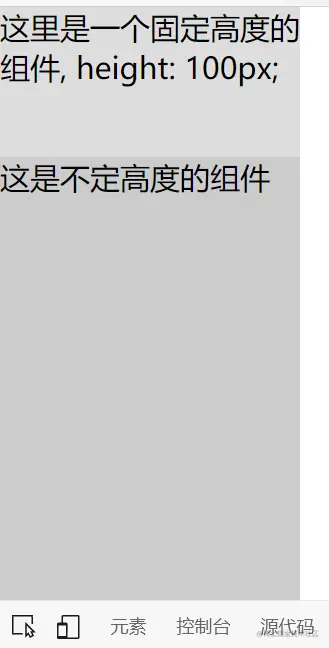

# 撑开高度

我们画页面的时候有可能遇到一种情况，一上一下两个元素，其中一个固定高度，然后我们希望另一个占据纵向所有剩余的高度。因为高度默认是以实际容器内内容高度为准的，也就是说默认情况下我们的元素不会在内容不足的情况下自动撑开高度占满空间 

**本文中元素位置如下，不做特殊说明的话本文的html结构不会有变化**

```html
<div class="outside-box">
	<div class="top-box">这里是一个固定高度的组件, height: 100px;</div>
	<div class="bottom-box">这是不定高度的组件</div>
</div>
```

当前的CSS如下

```css
.outside-box{
	width: 200px;
	height: 100vh;
	background-color: #eee;
}
.top-box{
	height: 100px;
	background-color: #ddd;
}
.bottom-box{
	background-color: #ccc;
}
```

当前的页面效果如下


【背景颜色是特地加的方便大家看清】 

现在我们需要将那个不定高度的组件的高度撑开，占满纵向剩余的空间，要怎么做呢？ 我这里提供两种做法 

calc
----

我们可以用calc实时计算不定高度组件的高度

```css
.bottom-box{
  height: calc(100% - 100px);
  background-color: #ccc;
}
```

效果如下



可以看到下面的不定高度组件的高度撑开占满了剩余的空间

但是calc是实时计算，性能不是特别好，大家慎用 

flex
----

我们也可以使用flex来实现

父组件要设置为flex，且设为纵向排布，然后子组件用flex-grow: 1占据所有剩余空间

```css
.outside-box{
  width: 200px;
  height: 100vh;
  display: flex;
  flex-direction: column;
  background-color: #eee;
}
.bottom-box{
  flex-grow: 1;
  background-color: #ccc;
}

```

效果如下


可以看到，不定高度的组件也是撑开高度占据了剩余空间 

应该说，flex-grow这个属性，能够决定剩余空间的分配，他会将所有剩余空间在所有有这个属性的元素之间进行分配，分配的比例就是各组件该属性值占所有组件该属性值总和的比例 

比如我再加第三个组件在下面，并设置flex-grow为2，这时就会有两个元素带有该属性，且属性值总和为3，则此时，中间的组件【flex-grow值为1】会占据三分之一的空间，下面的组件【flex-grow值为2】会占据三分之二的空间 

具体如下

```html
<div class="outside-box">
	<div class="top-box">这里是一个固定高度的组件, height: 100px;</div>
	<div class="bottom-box">这是不定高度的组件</div>
	<div class="box3">这是第三个组件</div>
</div>
<style>
.outside-box{
  width: 200px;
  height: 100vh;
  display: flex;
  flex-direction: column;
  background-color: #eee;
}
.top-box{
  height: 100px;
  background-color: #ddd;
}
.bottom-box{
  flex-grow: 1;
  background-color: #ccc;
}
.box3{
  flex-grow: 2;
}
</style>
```

效果如下图


其他
--

我这个时候又想了，那我如果在第一个元素上面加flex-grow属性会怎么样 

于是我将第一个元素的flex-grow设为10 

亲测没有任何事情发生 

所以，直接写明的height属性会覆盖flex-grow属性的效果，当有height又有flex-grow时，flex-grow属性会**直接失效**，甚至不参与flex-grow属性值总数的统计 

而flex-grow属性的效果**不会挤占已有明确高度/宽度设置的元素占据的空间** 


最后贴上完整代码，大家有需要的话自己拿去试试

```html
<!DOCTYPE html>
<html lang="en">
<head>
    <meta charset="UTF-8">
    <meta http-equiv="X-UA-Compatible" content="IE=edge">
    <meta name="viewport" content="width=device-width, initial-scale=1.0">
    <title>Document</title>
    <style>
        *{
            margin: 0px;
            padding: 0px;
        }
        .outside-box{
            width: 200px;
            height: 100vh;
            display: flex;
            flex-direction: column;
            flex-grow: 10;
            background-color: #eee;
        }
        .top-box{
            height: 100px;
            background-color: #ddd;
        }
        .bottom-box{
            flex-grow: 1;
            background-color: #ccc;
        }
        .box3{
            flex-grow: 2;
        }
    </style>
</head>
<body>
    <div class="outside-box">
        <div class="top-box">这里是一个固定高度的组件, height: 100px;</div>
        <div class="bottom-box">这是不定高度的组件</div>
        <div class="box3">这是第三个组件</div>
    </div>
</body>
</html>
```

  

本文转自 [https://juejin.cn/post/6966205043091603463](https://juejin.cn/post/6966205043091603463)，如有侵权，请联系删除。