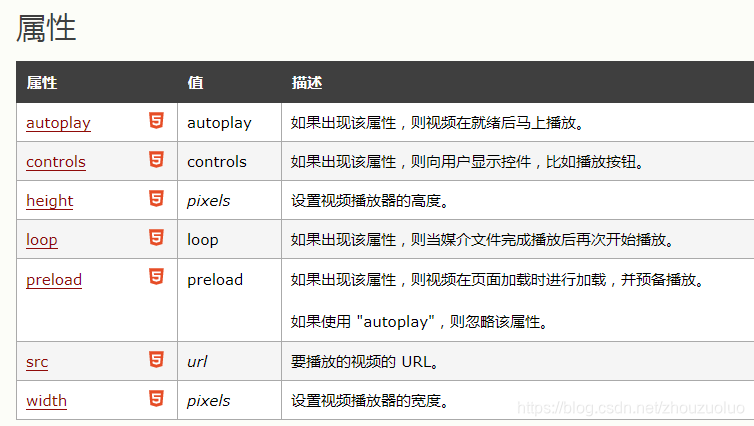

 

## 前言：

在 HTML 中播放视频并不容易！因为直到现在，仍然不存在一项旨在网页上显示视频的标准。今天，**大多数视频是通过插件（比如 Flash）来显示的**。然而，**并非所有浏览器都拥有同样的插件**。 比如**windows平台的IE浏览器利用Activex控件来播放flash而其它的浏览器则使用Netscape插件技术来播放flash**。而在HTML5 中规定了一种通过 video 元素来包含视频的标准方法，但 元素只支持三种视频格式：MP4、WebM、Ogg。

开发中我们希望**视频文件在所有浏览器中（Internet Explorer, Chrome, Firefox, Safari, Opera）和所有硬件上（PC, Mac , iPad, iPhone）**都能够播放。有时候甚至需要**保证在不同的浏览器上视频播放界面效果保持一致**。

在html内联视频中常用的多媒体视频文件格式是flash和mp4文件。flash视频内容可以使用或标签，mp4视频内容可以使用`<embed> 、<object> 、<video>`。但目前， **元素只支持三种视频格式：MP4、WebM、Ogg**。**标签是用于windows平台的IE浏览器的**，而 是用于windows和Macintosh平台下的Netscape Navigator浏览器以及Macintosh平台下的IE浏览器。

下面依次介绍`<embed> 、<object> 、<video>`各个标签的使用及视频播放的局限性，

## 1、 标签

**概述：** 标签是**HTML5中新增的标签**，**定义一个容器**，可以在页面中嵌入任何类型的文档。用户的机器上必须已经安装了能够正确显示文档内容的程序，一般**常用于在网页中插入多媒体格式可以是 Midi、Wav、AIFF、AU、MP3等**，IE、Firefox等最新浏览器都能支持。url为音频或视频文件及其路径，可以是相对路径和绝对路径。

**使用如下：**

```html
<embed src="test.mp4" type="video/mp4" width="400px" height="300px">
```

**注意事项：**

*   HTML4 无法识别 标签。
*   如果浏览器不支持 Flash(如未安装)，那么视频将无法播放。
*   iPad 和 iPhone 苹果设备不支持Flash 视频。（ipad的浏览器属于HTML5技术构架，可以不依赖Flash播放视频。）

补充：安卓系统从Android 2.1版本就开始部分支持flash，可下载安装flash插件播放视频。Adobe Flash Player 10.1.92.8已经支持所有android 2.2智能手机。目前主流的安卓智能机系统都在版本2.3以上，android4.0已大行其道。因此无须**对安卓设备采用单独的视频处理方案，安卓系统和windows系统采用同样的方案，使用flash播放器即可实现。**

## 2、 标签

**概述：**定义一个嵌入的对象**。请使用此元素向您的 XHTML 页面添加多媒体。此元素允许您规定插入HTML 文档中的对象的数据和参数，以及可用来显示和操作数据的代码**。

`<object>` 标签用于包含对象，比如图像、音频、视频、Java applets、ActiveX、PDF 以及 Flash。

object 的初衷是取代 img 和 applet 元素。不过由于漏洞以及缺乏浏览器支持，这一点并未实现。

object 对象提供了解决方案。如果不支持 object 元素，就会执行位于 和 之间的代码。通过这种方式，我们能够嵌套多个 object 元素（每个对应一个浏览器）。object是H4元素

**使用：**

```html
<!--位于 form 表单外的 <object> 元素（但仍然属于 form 表单的一部分） -->
<object width="400" height="400" data="helloworld.swf" form="form1" name="obj1"></object>
```

**注意事项：**

如果浏览器不支持 Flash，将无法播放视频。iPad 和 iPhone 不支持Flash 视频播放。不要对图像使用 标签，请使用 标签 代替。

**embed和object标签综合使用**

两者都是用来播放多媒体文件的对象，object元素用于IE浏览器，embed元素用于非IE浏览器，为了保证兼容性，通常我们同时使用两个元素，浏览器会自动忽略它不支持的标签。同时使用两个元素时，应该把标签放在标签的内部。

```html
<object classid="clsid:D27CDB6E-AE6D-11cf-96B8-444553540000" codebase="http://download.macromedia.com/pub/shockwave/cabs/flash/swflash.cab#version=6,0,29,0" width="700" height="400">
	<param name="movie" value="flvplayer.swf" />
	<param name="quality" value="high" />
	<param name="allowFullScreen" value="true" />
	<param name="FlashVars" value="vcastr_file=12.flv&LogoText=description&BufferTime=3&IsAutoPlay=1">
	<embed src="flvplayer.swf" allowfullscreen="true" flashvars="vcastr_file=12.flv&IsAutoPlay=1&LogoUrl=images/logo.jpg" quality="high" pluginspage="http://www.macromedia.com/go/getflashplayer" type="application/x-shockwave-flash" width="700" height="400"></embed>
</object>
```

上述代码详解： OBJECT标签是用于windows IE3.0及以后浏览器或者其它支持Activex控件的浏览器。“classid”和“codebase”属性必须要精确地按上例所示的写法写，它们告诉浏览器自动下载flash player的地址。如果你没有安装过flash player 那么IE3.0以后的浏览器会跳出一个提示框访问是否要自动安装flash player。当然，如果你不想让那些没有安装flash player的用户自动下载播放器，或许你可以省略掉这些代码。  
EMBED标签是用于Netscape Navigator2.0及以后的浏览器或其它支持Netscape插件的浏览器。“pluginspage”属性告诉浏览器下载flash player的地址，如果还没有安装flash player的话，用户安装完后需要重启浏览器才能正常使用。

## 3、HTML5 `<video>` 标签

**概述：** 标签定义视频，比如电影片段或其他视频流。

**使用：**

```html
<video width="320" height="240" controls>
  <source src="movie.mp4" type="video/mp4">
  <source src="movie.ogg" type="video/ogg">
  <source src="movie.webm" type="video/webm">
您的浏览器不支持 video 标签。
source标签提供多个媒体资源供不同的浏览器根据它对媒体类型或者编解码器的支持进行选择
</video>
```

属性如下：



**注意事项：**

当前， `<video>` 元素支持三种视频格式： MP4, WebM, 和 Ogg:。

须把视频转换为很多不同的格式。

但是**video、audio标签只在IE 9+、Safari 3+、FireFox 4+、Opera 10+、Chrome 3+的浏览器版本得到了支持**，并且各浏览器对于视频编码格式的支持不一致，这就需要我们考虑一个综合的实现方案，使得视频在不同浏览器中都能顺利播放，而且在老版本的浏览器中也能得到支持。

上述`<embed> 、<object> 、<video>`各个标签有各自的局限性，下面列出一些兼容各个浏览器视频播放的解决方式

## 4.1、video+object+embed

以下实例中使用了 4 种不同的视频格式。HTML 5 元素会尝试播放以 mp4、ogg 或 webm 格式中的一种来播放视频。如果均失败，则回退到 元素。**这样多种标签结合使用需要将视频转换为很多不同的格式**。。webm格式是针对FF浏览器的视频播放格式。

由于目前大多数设备的浏览器对flash支持的很好，所以考虑在不支持video标签时页面还是使用object/embed传统标签嵌入视频，用Adobe Flash Player播放。而对于**不支持flash的苹果设备**，可以制作另一个页面二。然后根据通过js程序对User-Agent的判断给不同的设备浏览器用户显示不同的页面

使用如下：

```html
<video width="320" height="240" controls>
  <source src="movie.mp4" type="video/mp4">
  <source src="movie.ogg" type="video/ogg">
  <source src="movie.webm" type="video/webm">
  <object data="movie.mp4" width="320" height="240">
    <embed src="movie.swf" width="320" height="240">
  </object> 
</video>
```

页面二针对mac设备代码：

```html
<script type="text/javascript">
	if ((/iPhone|iPad|iPod/i).test(navigator.userAgent) || (/Mac68K|MacPPC|Macintosh|MacIntel/i).test(navigator.platform)){
		 window.location.href = "####page2.html"
	}
</script> 
```

## 4.2、使用超链接启动“辅助应用程序”播放

如果**网页包含指向媒体文件的超链接，大多数浏览器会使用"辅助应用程序"来播放文件。**

以下代码片段显示指向 AVI 文件的链接。如果用户点击该链接，浏览器会启动"辅助应用程序"，比如 Windows Media Player 来播放这个 AVI 文件：

```html
<a href="test.mp4">Play a video file</a>
```

## 4.3、**关于内联视频的说明**

当视频被包含在网页中时，它被称为内联视频。

如果您打算在 web 应用程序中使用内联视频，您需要意识到很多人都觉得内联视频令人恼火。

同时请注意，用户可能已经关闭了浏览器中的内联视频选项。

我们最好的建议是只在用户希望看到内联视频的地方包含它们。一个正面的例子是，**在用户需要看到视频并点击某个链接时，会打开页面然后播放视频**。

可以将视频上传到视频网站或服务器，获取视频资源分享链接，然后进行src引用

## **4.4、html5media.js插件**:

是一个让video、audio标签在旧版IE中全面兼容的JavaScript类库。实现的原理大致是使用了flash技术，使用flash播放器嵌入视频的方式，使得老版本IE及Firefox支持`video`标签。这个播放器称为flowplayer。。。

**使用步骤：**

```html
<script src="html5media.min.js"></script>
 
<video src="test.mp4" width="352" height="264" controls autobuffer></video>
```

**下载网址**：链接：https://pan.baidu.com/s/1vRgCnY-wWNJ9BcfiMgOeXQ 提取码：ynw4

**注意事项：**目前，这种多浏览器支持**方法所支持的视频格式有限，为mp4和ogv格式**，否则视频可能不会播放。**使用video标签实现视频播放\*_在不同浏览器下video样式各不相同\*_**

## 4.5、 hivideo.js ：

是一款基于html5的视频播放器，**摒弃video原有的播放控制条样式，自己重写了一次,让播放器在各个浏览器下样式统一**。支持暂停、播放进度控制、声音控制、全屏播放。如果是要在**手机端使用hivideo，全屏播放时还支持横屏播放**。几乎兼容所有的浏览器，并且优先使用html5，在不支持的浏览器中，会自动使用flash进行播放。

**使用步骤：**

```html
<link rel="stylesheet" href="assets/hivideo.css" />
<script src="assets/hivideo.js"></script>
```
```html
<div class="main-wrap">
    <video ishivideo="true" autoplay isrotate="false" autoHide="true">
        <source src="assets/test.mp4" type="video/mp4">
    </video>
</div>
```

如果是后期动态添加的video元素，也可以通过hivideo动态加载。例如页面动态添加了一个id为”player”的video元素，可通过如下方式把video转换为hivideo播放器：

```js
hivideo(document.getElementById("player"));
```

**下载网址**：https://github.com/heavis/hivideo

## 4.6、video.js:

Video.js 是一个通用的在网页上嵌入视频播放器的 JS 库，它支持HTML5和Flash视频，Video.js 自动检测浏览器对 HTML5 的支持情况，如果不支持 HTML5 则自动使用 Flash 播放器。支持在桌面和移动设备上播放视频。

详细使用可以参考 https://www.awaimai.com/2053.html

```html
<head>
  <link href="https://vjs.zencdn.net/7.6.0/video-js.css" rel="stylesheet">
 
  <!-- If you'd like to support IE8 (for Video.js versions prior to v7) -->
  <script src="https://vjs.zencdn.net/ie8/1.1.2/videojs-ie8.min.js"></script>
</head>
 
<body>
  <video id='my-video' class='video-js' controls preload='auto' width='640' height='264'
  poster='MY_VIDEO_POSTER.jpg' data-setup='{}'>
    <source src='MY_VIDEO.mp4' type='video/mp4'>
    <source src='MY_VIDEO.webm' type='video/webm'>
    <p class='vjs-no-js'>
      To view this video please enable JavaScript, and consider upgrading to a web browser that
      <a href='https://videojs.com/html5-video-support/' target='_blank'>supports HTML5 video</a>
    </p>
  </video>
 
  <script src='https://vjs.zencdn.net/7.6.0/video.js'></script>
</body>
```

**注意事项**：要支持IE低版本就需要下载video.js低版本

## 知识拓展：

### 1.1、常见视频格式有哪些？？

**.AVI, .wma, .rmvb,.rm, .flash,.mp4,.mid, 3GP**等视频格式是比较常见的。其中AVI一般比较大, 也是最清晰的一种,rmvb,wma中等清晰, rm格式小且清晰度稍微差些. .**flash,.mp4,.mid, 3GP都是格式比较小的适合网络播放与移动媒体设备播放用的**.

### 1.2、flash视频和 mp4 视频有什么区别？？

Flash是动画文件，是基于矢量图形的，是通过Flash软件制作的，使用 .swf的文件后缀。而Mp4是视频文件，是采用mpeg编码的一类多媒体影音混合文件，文件后缀为.mp4，是通过某些介质录制或者制作的，以储存数码音讯及数码视频为主。

注意：**Flash 成为嵌入网页中的小游戏、动画以及图形用户界面常用的格式**。flash的播放需要使用flash player插件，有插件版和IE专用版本，就是浏览器的一种插件。

### 1.3、htnl5shiv.js概述

对于**老版本的IE可以通过HTML5shiv来使不支持HTML5的浏览器支持HTML新标签video和audio标签**。主要解决HTML5提出的新的元素不被IE6/IE7/IE8识别，这些新元素不能作为父节点包裹子元素，且不能应用CSS样式。让CSS 样式应用在未知元素只需执行 document.createElement(elementName) 即可实现。html5shiv的工作原理也就是基于此。html5shiv.js的网盘地址是：链接：https://pan.baidu.com/s/1Db9Gzqz66eYEz01BWhwAIQ 提取码：5vzk

```html
<!–[if lt IE 9]> 
	<script type="text/javascript" src="html5shiv.js"></script> 
<![endif]–>
```

参考学习网址：

https://www.runoob.com/html/html-videos.html

https://www.zhangxinxu.com/wordpress/2010/03/every-browser-support-html5-video/

https://www.jianshu.com/p/16fa00a1ca8e

https://blog.csdn.net/enweitech/article/details/80802677

https://blog.csdn.net/freshlover/article/details/7535785#

视频在浏览器播放格式，视频浏览器播放格式演示
-------------------------------------------------------------------------------------

### 1\. 什么是视频在浏览器播放格式

视频在浏览器播放格式，通常指的是互联网上常见的视频文件格式，例如MP4、FLV、AVI等。这些格式通常被用于存储和传输视频内容，并且兼容多种不同的浏览器和设备。在播放视频时，浏览器需要一个播放器来解析和播放视频文件。

### 2\. 常见的视频浏览器播放格式

2.1 MP4格式

MP4是最常见的视频播放格式之一，它可以在大多数现代浏览器和设备上播放。MP4格式通常使用H.264编码，可以通过改变视频和音频的比特率来控制视频质量和文件大小。同时，MP4格式还支持字幕、元数据和章节信息等功能。

2.2 FLV格式

FLV格式是一种Adobe Flash Player所支持的视频格式。由于Flash Player广泛应用于互联网上的视频播放，因此FLV格式在许多网站上也被广泛使用。FLV格式的一个不足之处是它不能在iOS设备上直接播放。

2.3 AVI格式

AVI格式是一种由Microsoft开发的视频格式，它通常使用xvid或DivX编码。AVI文件较大，但播放器对它的支持很广泛。不过，AVI格式不能在Mac OS X和iOS设备上本地播放。

### 3\. 如何在浏览器中播放视频

要在浏览器中播放视频，你需要一个适当的视频播放器。现在，许多浏览器都内置了HTML5视频播放器，例如Chrome、Firefox和Safari等。这些浏览器支持MP4、WebM和Ogg视频格式。

如果你需要使用其他视频格式，你可以使用轻量级的嵌入式播放器，例如Video.js、JW Player和FlowPlayer等。这些播放器支持多种视频格式，并且可以通过JavaScript API进行控制。

### 4\. 如何优化视频播放体验

4.1 选择合适的视频格式

选择适当的视频格式可以大大提高视频播放的效率和用户体验。如果你需要在多个平台（例如桌面和移动设备）上播放视频，可以选择MP4格式。如果你的网站主要面向桌面用户，可以考虑使用FLV或AVI等其他格式。

4.2 压缩视频文件

视频文件的大小通常很大，这会影响视频加载速度和播放质量。因此，你可以使用视频压缩工具来缩小文件大小。例如，你可以使用 Handbrake、Adobe Media Encoder 等工具来压缩视频文件并降低视频文件的大小。

4.3 选择适当的视频分辨率

适当的分辨率可以提供良好的视频清晰度和流畅的播放。如果你的视频主要面向桌面用户，可以选择高分辨率的视频。但是，如果你的网站主要面向移动设备用户，可以选择较低分辨率的视频以提高播放效率和用户体验。

4.4 使用流式传输

流式传输是指在视频播放期间边下载边播放视频，以提高视频播放速度和流畅性。如果你的服务器支持流式传输，可以使用这种技术来改善视频播放体验。

### 5\. 如何处理视频兼容性问题

5.1 浏览器兼容性问题

不同的浏览器支持不同的视频格式和编解码器。为确保视频在不同浏览器上播放，你可以采取以下措施：

\- 检测浏览器的支持情况，并选择相应的视频格式

\- 提供备选格式，当用户的浏览器不支持主格式时使用备选格式

5.2 设备兼容性问题

不同设备和操作系统也支持不同的视频格式和编解码器。为确保视频在不同设备上的兼容性，你可以采取以下措施：

\- 提供多种视频格式，以便在不同设备上选择适当的格式

\- 针对具体设备和操作系统优化视频格式和编解码器

总之，视频在浏览器播放格式是一个复杂的问题，需要考虑多种因素，例如兼容性、效率和用户体验等。在选择视频格式和播放器时，需要根据实际需求和用户群体做出适当的选择，以提供最佳的视频播放体验。

 

  

本文转自 [https://blog.csdn.net/qq\_43842093/article/details/135893572](https://blog.csdn.net/qq_43842093/article/details/135893572)，如有侵权，请联系删除。