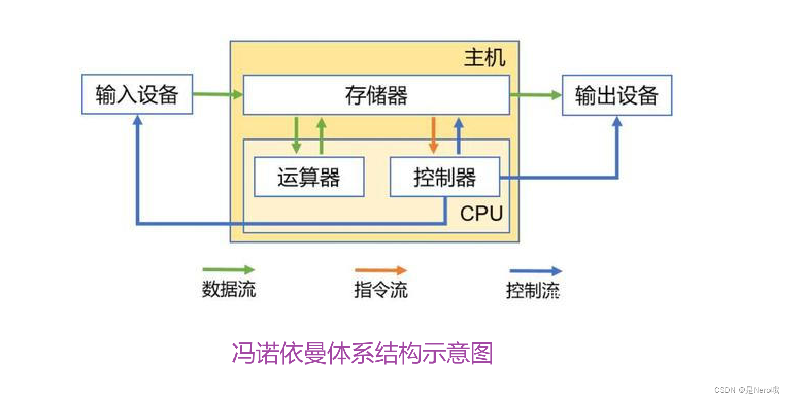
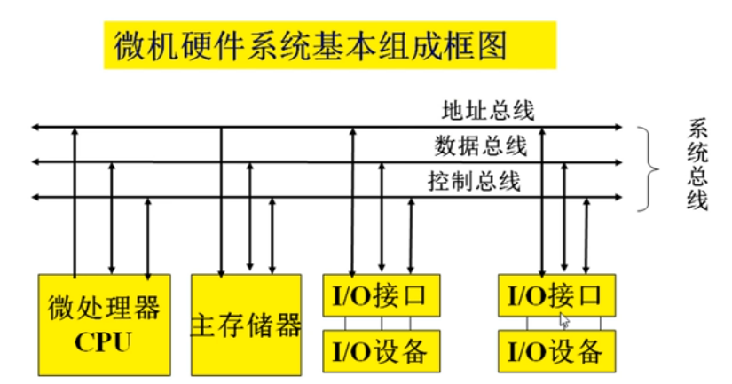
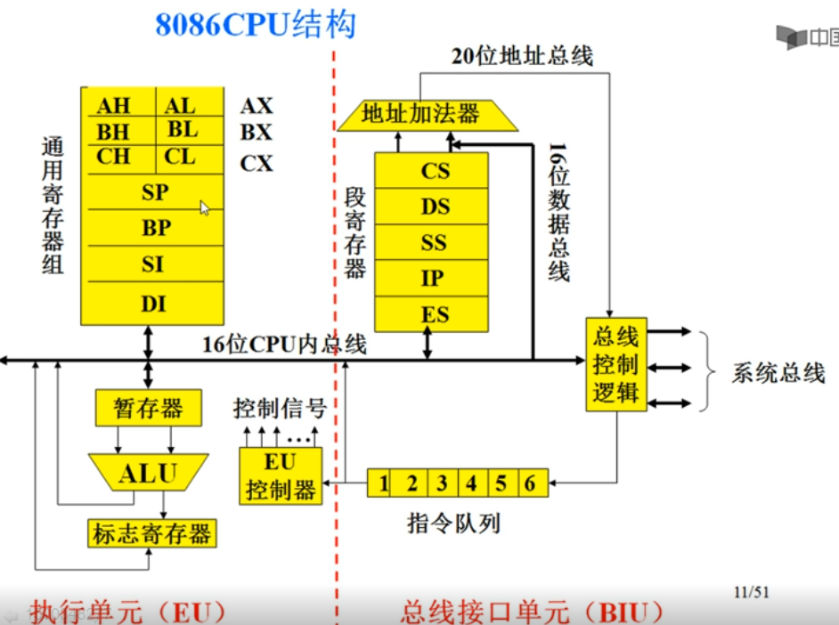

## CPU的出现

CPU出现于大规模集成电路时代，从4位到8位、16位、32位处理器，最后到64位处理器，从各厂商互不兼容到不同指令集架构规范的出现，CPU 自诞生以来一直在飞速发展。 

CPU发展已经有40多年的历史了。我们通常将其分成六个阶段。 

### (1)第一阶段(1971~1973)

这是4位和8位低档微处理器时代，代表产品是Intel 4004处理器

1971年，Intel生产的4004微处理器将[运算器](https://so.csdn.net/so/search?q=运算器&spm=1001.2101.3001.7020)和控制器集成在一个芯片上，标志着CPU的诞生

### (2)第二阶段(1974~1977)

这是8位中高档微处理器时代，代表产品是Intel 8080。此时指令系统已经比较完善了。 

### (3)第三阶段(1978~1984)

这是16位微处理器的时代，代表产品是Intel 8086。相对而言已经比较成熟了。 

1978年，8086处理器的出现奠定了X86指令集架构， 随后8086系列处理器被广泛应用于个人计算机终端、高性能服务器以及云服务器中。 

### (4)第四阶段(1985~1992)

这是32位微处理器时代，代表产品是Intel 80386。已经可以胜任多任务、多用户的作业。 

1989 年发布的80486处理器实现了5级标量流水线，标志着CPU的初步成熟，也标志着传统处理器发展阶段的结束。 

### (5)第五阶段(1993~2005)

这是奔腾系列微处理器的时代。 

1995 年11 月，Intel发布了Pentium处理器，该处理器首次采用超标量指令流水结构，引入了指令的乱序执行和分支预测技术，大大提高了处理器的性能， 因此，超标量指令流水线结构一直被后续出现的现代处理器，如AMD（Advanced Micro devices）的锐龙、Intel的酷睿系列等所采用。 

x84_64是x86 CPU开始迈向64位的时候，有2选择：
1、向下兼容x86。
2、完全重新设计指令集，不兼容x86。

- AMD比Intel率先制造出了商用的兼容x86的CPU，AMD称之为AMD64，抢了64位PC的第一桶金，得到了用户的认同。
- Intel选择了设计一种不兼容x86的全新64为指令集，称之为IA-64（这玩意似乎就是安腾），但是比amd晚了一步，而且IA-64也挺惨淡的，因为是全新设计的CPU，没有编译器，也不支持windows（微软把intel给忽悠了，承诺了会出安腾版windows server版，但是迟迟拿不出东西）
- 后来不得不在时机落后的情况下也开始支持AMD64的指令集，但是换了个名字，叫x86_64，表示是x86指令集的64扩展

### (6)第六阶段(2005)

处理器逐渐向更多核心，更高并行度发展。

典型的代表有英特尔的酷睿系列处理器和AMD的锐龙系列处理器。为了满足操作系统的上层工作需求，现代处理器进一步引入了诸如并行化、多核化、虚拟化以及远程管理系统等功能，不断推动着上层信息系统向前发展。 

## 工作原理

冯诺依曼体系

冯诺依曼体系结构是现代计算机的基础。

在该体系结构下，程序和数据统一存储，指令和数据需要从同一存储空间存取，经由同一总线传输，无法重叠执行。

根据冯诺依曼体系，CPU的工作分为以下 5 个阶段：取指令阶段、指令译码阶段、执行指令阶段、访存取数和结果写回。 

- 取指令（IF，instruction fetch）

  即将一条指令从主存储器中取到指令寄存器的过程。
  程序计数器中的数值，用来指示当前指令在主存中的位置。当 一条指令被取出后，程序计数器（PC）中的数值将根据指令字长度自动递增。        

- 指令译码阶段（ID，instruction decode）

  取出指令后，指令译码器按照预定的指令格式，对取回的指令进行拆分和解释，识别区分出不同的指令类 别以及各种获取操作数的方法。现代CISC处理器会将拆分已提高并行率和效率。

- 执行指令阶段（EX，execute）
  具体实现指令的功能。
  CPU的不同部分被连接起来，以执行所需的操作。

- 访存取数阶段（MEM，memory）
  根据指令需要访问主存、读取操作数，CPU得到操作数在主存中的地址，并从主存中读取该操作数用于运算。
  部分指令不需要访问主存，则可以跳过该阶段。 

- 结果写回阶段（WB，write back）
  作为最后一个阶段，结果写回阶段把执行指令阶段的运行结果数据“写回”到某种存储形式。
  结果数据一般会被写到CPU的内部寄存器中，以便被后续的指令快速地存取；许多指令还会改变程序状态字寄存器中标志位的状态，这些标志位标识着不同的操作结果，可被用来影响程序的动作。 

在指令执行完毕、结果数据写回之后，若无意外事件（如结果溢出等）发生，计算机就从程序计数器中取得下一条指令地址，开始新一轮的循环，下一个指令周期将顺序取出下一条指令。 许多复杂的CPU可以一次提取多个指令、解码，并且同时执行。

## CPU指令集

CPU指令集是存储在CPU内部，‌对CPU运算进行指导和优化的硬程序，‌是软件与硬件之间的接口规范。‌

它定义了一组基本指令以及这些指令的操作格式、‌编码方式、‌寻址模式等。‌

不同的CPU架构（‌如x86、‌ARM、‌RISC-V等）‌拥有不同的指令集。‌

指令集的先进与否直接关系到CPU的性能发挥，‌是CPU性能体现的一个重要标志。‌

- **x86指令集**‌：‌由Intel开发，‌属于复杂指令集（‌CISC）‌，‌广泛应用于个人计算机和服务器领域。‌

- **ARM指令集**‌：‌属于精简指令集（‌RISC）‌，‌广泛应用于移动设备、‌嵌入式系统和服务器。‌

- **RISC-V指令集**‌：‌是一种基于RISC原理建立的开放指令集架构（‌ISA）‌，‌具有开源和模块化设计的特点。‌

### x86/x64/amd64

| 架构   | 简称      | 位数 | 原因                                                         |
| ------ | --------- | ---- | ------------------------------------------------------------ |
| x86    | CISC      | 32位 | 英特尔出的处理习惯以86为结尾 如80186、80286、80386，所以之后被称之为 X86 |
| x86-64 | amd64/x64 | 64位 | x86架构的64位扩展版本。‌ 该指令集由AMD于1999年设计并推出， 随后被英特尔所采用，‌并命名为“Intel 64”。‌ |
| amd64  | amd64/x64 | 64位 | 由AMD于1999年设计并推出                                      |

- 实际上，x86_64,x64,AMD64基本上是同一个东西，我们现在用的intel/amd的桌面级CPU基本上都是x86_64
  与之相对的arm,ppc等都不是x86_64。

- x86、x86_64主要的区别就是32位和64位的问题，x86中只有8个32位通用寄存器，eax,ebx,ecx，edx, ebp, esp, esi, edi。
- x86_64把这8个通用寄存器扩展成了64位的，并且比x86增加了若干个寄存器（好像增加了8个，变成了总共16个通用寄存器）。同样的MMX的寄存器的位数和数量也进行了扩展。此外cpu扩展到64位后也能支持更多的内存了，等等许多好处。

现在的x86CPU在位数上由32/64bit之分，在ARCH上又有x86/x86_64/x64/i386/IA32/IA64/amd64

简单可按照下述理解：

- x86=i386=IA32
- amd64=x86_64=x64

64bit的CPU都做了向下兼容32bit的特殊设计，所以在64bit CPU上运行32bit的软件（kernel、app、driver）是没有问题的。反之则不行。

### arm/arm64/aarch64

#### 简介

ARM ：Advanced RISC Machines（最初命名为Acorn RISC Machine）简称ARM。

对ARM可以有三种理解:

1. ARM公司：Advanced RISC Machines Limited

2. ARM处理器架构

3. 一种技术——ARM技术

ARM 公司是全球领先的半导体知识产权 (IP) 提供商，并因此在数字电子产品的开发中处于核心地位。 ARM 公司的总部位于英国剑桥，它拥有 1700 多名员工，在全球设立了多个办事处，其中包括比利时、法国、印度、瑞典和美国的设计中心。

#### 发展史

ARM公司的前身——Acorn Computer公司由Andy Hopper和另外两位创始人Hermann Hauser、Chris Curry于1978年联合创办，被人称作“**英国的苹果电脑公司**”。在1978年3月，Hauser和Sinclair公司的工程师Chris Curry一起，创办了CPU公司（Cambridge Processing Unit)。在当年12月，2人和Andy Hopper一起创立了Acorn公司。Andy Hopper现在是剑桥大学的教授，计算机研究所的所长。CPU公司变成了一个开发和控股公司。而Acorn公司不久后就开始贩卖家用电脑Atom（这个名字居然和现在英特尔推出的、用于和ARM竞争的凌动CPU的名字相同！）。这比苹果电脑也晚不了一点，比IBM的PC要早。因为这个原因，1982年，跟大名鼎鼎的英国广播公司BBC合作，贩卖教育用的计算机BBC Micro,并大大的出了名。这样，1983年，Acorn公司取得了盈利860万英镑的好成绩，Hauser和Curry将CPU公司卖掉了，分别得到了6400万英镑和5100万英镑。这个BBC Micro在1984年得到了女王技术奖。在这之前的1983年，美国的苹果公司，使用摩托罗拉公司的16位CPU68000，开发了Lisa计算机。这时，已经发展到400多人的Acorn公司，认为将来需要性能更好的处理器，于是，决定开发当时不被看好的RISC结构的处理器。这也是因为，一个资源不丰富，由门外汉组成的创业公司，没有能力开发CISC结构的处理器，而不得不选择开发晶体管数较少的RISC处理器。

实际的情形是，Acorn Computer公司在BBC Micro computer上取得了一定程度的成功，在此之后他们思考如何将相对简单的MOS Technology 6502处理器转移到类似于1981年投产的IBM PC商业市场。当时的ABC（Acorn Business Computer）公司计划在BBC Micro平台上大量使用第二款处理器，但是当时的Motorola 68000和National Semiconductor 32016并不适合，而6502在图形用户接口方面性能不够强大。

很显然，Acorn需要一种新架构，他们认为既然一帮刚从大学毕业的大学生都能设计出有竞争力的32位处理器，Acorn自己更没问题！于是， Acorn的工程师Steve Furber和Sophie Wilson在美国Phoenix的Western Design Center改进了6502，他们没有花费太多的研发资源。Wilson设计了指令集并在BBC Micro上成功运行了这个被称作第二款6502处理器的模拟器。之后，Wilson得到了Acorn的CEO—Hermann Hauser的支持，组建了一个团队完成Wilson设计的硬件实现。

1983年10月，官方的Acorn RISC Machine项目正式启动，半导体合作方VLSI Technology, Inc提供ROM和样片，Furber和Wilson主要负责设计，他们的目标是设计一款低I/O延迟类似于6502的处理器。

1985年4月26日，Acorn Computer Group 开发出全球第一款商业 RISC 处理器——第一个ARM原型（ARM1）在英国剑桥的Acorn计算机有限公司诞生，由美国加州SanJoseVLSI技术公司制造（VLSI Technology 成为投资商和第一个授权使用方）。

第二年，改良版的ARM2也出来了。这是集成了3万个晶体管的32位数据线的工作时钟8兆的，当时极为先进的处理器。由美国的VLSI公司制造。当时使用了最先进的3微米的制程。

这个ARM2被使用在了Acorn公司的计算机BBC Archimedes 305上。当时，IBM的PC已经占据了市场的主流，而BBC Archimedes是采用一个非主流的Archimedes操作系统，因此，除了作为BBC Micro的后继机卖给广播局和学校外，在英国以外的其他市场，几乎卖不动。

尽管形势不妙，Acorn公司还是开发了带缓存的工作时钟为25M的ARM3。在1990年，这个处理器使用在了他们自己公司的台式机Acorn Archimedes 540/1上，也没有取得什么成功。

在1990年，Acorn拆分出ARM作为一家独立的公司（Advanced RISC Machines Limited），而苹果公司则出资300万美元买下了其中30%的股份（在随后若干年里，它逐渐抛售了这些股份）。1991年，ARM 推出第一款嵌入式 RISC 核心，即 ARM6 解决方案。苹果电脑使用ARM6架构的ARM 610来作为他们Apple Newton PDA的基础。在1994年，Acorn使用ARM 610作为他们RISC PC电脑内的CPU。

1993年ARM 推出 ARM7 核心；

1995年，Digital Semiconductor 推出第一款 StrongARM 核心；

1996年，ARM 和 VLSI Technology 推出了 ARM810 微处理器；

1997年，ARM发布 ARM9TDMI 系列；

1998年，ARM 开发了可合成的 ARM7TDMI 核心版本；

1999年，ARM 发布可合成的 ARM9E 处理器，提高了信号的处理能力；

2000年，ARM 发布 SecurCore 智能卡系列；

2001年，ARM 发布ARMv6 微体系结构；

2002年，ARM 发布 ARM11 微体系结构；

2004年，ARM 发布基于 ARMv7 体系结构的 Cortex 处理器系列。 同时发布作为新型处理器系列中首款的 ARM Cortex-M3；发布第一款集成多处理器，即 MPCore 多处理器；

2005年，ARM 发布 Cortex-A8 处理器；

2007年，发布了 ARM Cortex-M1 处理器，它是第一款专为 FPGA 中的实现设计的 ARM 处理器；ARM 推出 Cortex-A9 处理器以实现可扩展性能和低功耗设计；ARM 推出针对智能卡应用的 SecurCore SC300 处理器；

2009年，RM 宣布实现具有 2GHz 频率的 Cortex-A9 双核处理器；ARM 推出体积最小、功耗最低和能效最高的处理器 Cortex-M0；

2010年，ARM正式宣布推出Cortex-A15 MPCore处理器，相比当前的高级智能手机处理器，可在同等功耗水平上带来5倍的性能提升。Cortex-A15处理器基于ARMv7-A Cortex微架构，单个处理器集群内拥有1-4个SMP处理核心，彼此通过AMBA 4技术互联，能够在不断下降的功耗、散热和成本预算基础上提供高度可扩展性解决方案，广泛适用于下一代智能手机、平板机、大屏幕移动计算设备、高端数字家庭娱乐终端、无线基站、企业基础架构产品等等。

​    关于StrongARM 和XScale ——ARM推出嵌入式核心之后，DEC公司获得许可并在ARM6架构上开发出增强版的StrongARM 处理器（233MHz主频，仅1W功耗），后来DEC公司被康柏所合并，而StrongARM核心则被Intel买走，属于该体系的SA1110处理器被长时间用于Pocket PC中（PDA中的一种，采用Windows CE操作系统）。Intel在接手之后对其进行改进，并在2002年2月份正式推出基于StrongARM的下一代架构—XScale。从2006年开始，英特尔公司便开始逐渐清理通信芯片业务。当时，英特尔公司把手机芯片业务以6亿美元的价格转让给了Marvell公司。

#### ARM处理器系列

ARM提供一系列内核、体系扩展、微处理器和系统芯片方案。由于所有产品均采用一个通用的软件体系，所以相同的软件可在所有产品中运行（理论上如此）。典型的产品如下：ARM7系列、ARM9系列、ARM9E系列、ARM10E系列、ARM11系列、SecurCore系列、Inter的StrongARM和Xscale系列、Cortex-A/R/M系列。其中，ARM7、ARM9、ARM9E、ARM10和ARM11为前期5个通用处理器系列，每一个系列提供一套相对独特的性能来满足不同应用领域的需求。SecurCore系列专门为安全要求较高的应用而设计，Cortex-A/R/M为ARM分别针对Applicaion、Realtime和Microcontroller领域开发的的新一代处理器系列。

ARM处理器简表：

|              | ARM内核                                    | ARM指令集架构 |
| ------------ | ------------------------------------------ | ------------- |
| ARM7TDMI系列 | ARM710T                                    | ARMv4T        |
|              | ARM720T                                    |               |
|              | ARM740T                                    |               |
|              | ARM7TDMI(-S)                               |               |
|              |                                            |               |
| ARM9TDMI系列 | ARM920T                                    | ARMv4T        |
|              | ARM922T                                    |               |
|              | ARM940T                                    |               |
|              | ARM9TDMI                                   |               |
|              |                                            |               |
| ARM9E系列    | ARM946E-S                                  | ARMv5TE       |
|              | ARM966E-S                                  |               |
|              | ARM968E-S                                  |               |
|              | ARM926EJ-S                                 | ARMv5TEJ      |
|              |                                            |               |
| ARM10E系列   | ARM1020E                                   | ARMv5TE       |
|              | ARM1022E                                   |               |
|              | ARM1026EJ-S                                | ARMv5TEJ      |
| ARM11系列    | ARM1136J(F)-S                              | ARMv6         |
|              | ARM1156T2(F)-S                             | ARMv6T2       |
|              | ARM1176JZ(F)-S                             | ARMv6KZ       |
|              | ARM11 MPcore                               | ARMv6K        |
|              |                                            |               |
| Cortex系列   | Cortex-A8/A9/A5/A15                        | ARMv7-A       |
|              | Cortex-R4/R5/R7                            | ARMv7-R       |
|              | Cortex-M0/ M3/M4                           | ARMv7-M       |
|              | Cortex-M1                                  | ARMv6-M       |
|              |                                            |               |
| StrongARM    | SA110、SA1110                              | ARMv4         |
|              |                                            |               |
| XScale系列   | PXA25x、PXA26x、PXA27x、PXA3xx、IXPXXX系列 | ARMv5TE       |

目前可以已经license ARM的著名欧美半导体公司有：Alcatel-Lucent，Apple Inc.，Atmel，Broadcom， Cirrus Logic， Digital Equipment Corporation， Freescale，Intel (through DEC)，LG， Marvell Technology Group， Microsoft， NEC，Nuvoton，Nvidia，NXP (previously Philips)，Oki， ON Semiconductor，Qualcomm,，Samsung， Sharp，STMicroelectronics， Symbios Logic，Texas Instruments，VLSI Technology，Yamaha ，ZiiLABS等。

这样的一个商业生态链的力量是巨大的，它意味着，每一个芯片公司都可以选择不同的操作系统供应商。每一种操作系统也可以同时支持多家芯片供应商，这是一个多对多的关系，而其核心则是ARM。

ARM在终端消费领域是一枝独秀的，无人能撼动其霸主地位，想必Intel为当年卖掉其Xscale而悔恨终身吧，2014年Intel倒贴70亿美金补贴芯片厂家助力Intel进军消费市场，赔本赚吆喝。ARM已不满足低端的消费市场，一颗红心携ARM64进军Intel的核心领域---DC市场，随着ARM64这把火一点燃，各厂家纷纷在ARM64这块领域上掘金，其中不乏一脚两船的 Broadcom和Cavium，Broadcom和Cavium是最大的MIPS处理器供应商，但都在ARM64这块竞技场发力，2014年Qualcomm也宣布进军ARM64服务器市场，好热闹！尽管ARM在消费领域的Ecosystem是成熟的，但在服务器领域其Ecosystem还欠完善，相信随着众多有实力厂家的参与，Ecosystem会逐步标准化及成熟起来，到时，高端处理器领域会有更多的可选择方案。

